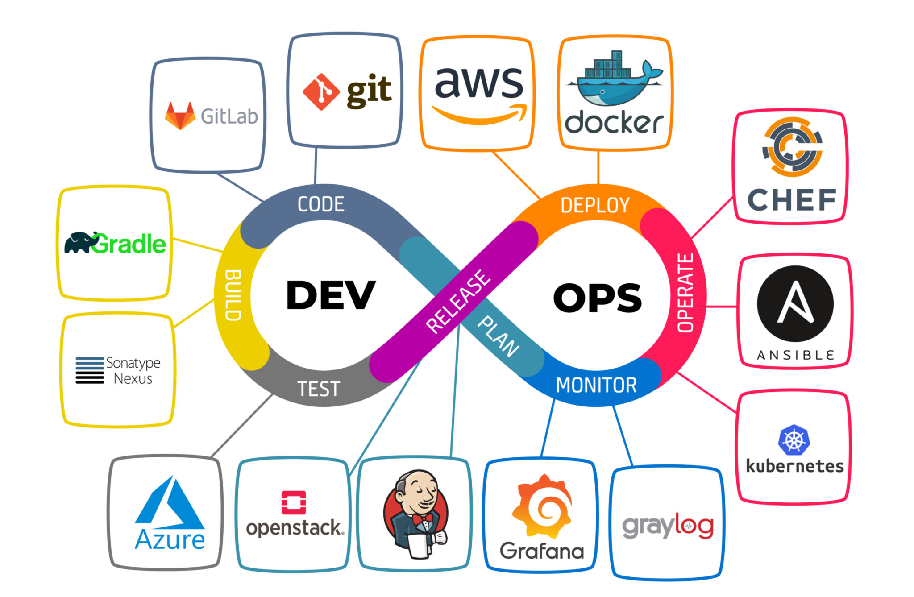

<!-- ШИРОКАЯ ШАПКА-БАННЕР -->

  

**Контакты:**
- 📧 Email: Evgeniy_0307@mail.ru
- 💻 GitHub: [Evgenii-379](https://github.com/Evgenii-379)
- 

---

## 👋 Коротко обо мне
Привет! Я начинающий DevOps-инженер. Ранее работал электриком и электромонтажником, собирал щиты управления и занимался автоматизацией оборудования. 
Этот опыт работы с реальными системами и внимательность к деталям помогли мне в новой профессии.
Сейчас развиваюсь в IT и фокусируюсь на автоматизации инфраструктуры, контейнеризации и CI/CD.

---

## 🛠️ Ключевые навыки

- **Инструменты CI/CD:** GitHub Actions, Jenkins, GitLab CI/CD
- **Облака и IaC:** Yandex Cloud (YC), AWS, Terraform, Ansible
- **Контейнеризация и оркестрация:** Docker, Kubernetes
- **Мониторинг и логи:** Zabbix, Grafana, Prometheus, ELK Stack (Elasticsearch, Logstash, Kibana)
- **Языки и ОС:** Python, Bash, Linux (Ubuntu, Debian, CentOS), SSH
- **Базы данных и веб-серверы:** PostgreSQL, MySQL, Nginx
- **Анализ сетей и диагностика:** Wireshark, понимание сетевых моделей (TCP/IP), диагностика HTTP/HTTPS-запросов

---

## 🚀 Проекты

### Дипломная работа — CI/CD для веб-приложения
**Задача:** построить автоматический процесс тестирования и доставки приложения.
**Действия:** настроил GitHub Actions для запуска тестов, сборки Docker-образа и деплоя; написал документацию в README.
**Результат:** приложение собирается и деплоится автоматически при изменении кода.
🔗 [Смотреть проект](https://github.com/Evgenii-379/Diploma-practical-course-in-Yandex.Cloud/blob/main/README.md)

---

### Курсовой проект — Инфраструктура в Yandex Cloud
**Задача:** развернуть инфраструктуру с балансировщиком, мониторингом, тестовым приложением и стеком ELK.
**Действия:** с помощью Terraform создал виртуальные машины и сети в Yandex Cloud; настроил балансировщик нагрузки; установил Prometheus и Grafana для мониторинга; настроил сбор логов через ELK.
**Результат:** получилась рабочая инфраструктура, где все сервисы взаимодействуют между собой и обеспечивают отказоустойчивость приложения.
🔗 [Смотреть проект](https://github.com/Evgenii-379/Coursework_netology/blob/main/README.md)

---

## 📜 Сертификаты и обучение
- Нетология — курс «DevOps-инженер с нуля» (курсовая и дипломная работы представлены выше).
- [certificates](https://drive.google.com/drive/folders/198_8obXqmbAYV2dejvGyJ_E6s6tjhSyH?usp=sharing)

---

## 📌 Дополнительно
- Готов к командной работе и обмену опытом.
- Ориентирован на автоматизацию процессов и повышение надёжности систем.

---

